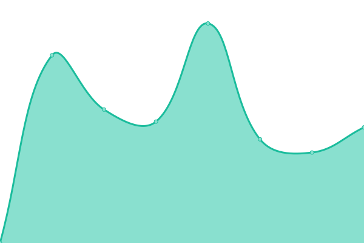
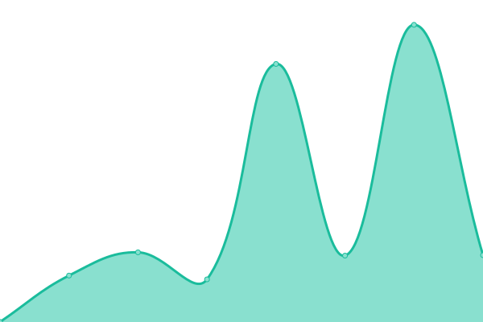

# [📈 Live Status](https://demo.upptime.js.org): <!--live status--> **🟧 Partial outage**

This repository contains the open-source uptime monitor and status page for [Savi](https://demo.upptime.js.org),

<!--start: status pages-->
<!-- This summary is generated by Upptime (https://github.com/upptime/upptime) -->
<!-- Do not edit this manually, your changes will be overwritten -->
<!-- prettier-ignore -->
| URL | Status | History | Response Time | Uptime |
| --- | ------ | ------- | ------------- | ------ |
|  [Offermanager](https://coupons.valassis.eu/capi) | 🟩 Up | [offermanager.yml](https://github.com/djimenez-savi/savi-sites-monitor/commits/HEAD/history/offermanager.yml) | 

 1712ms
     
 | 

<a href="https://djimenez-savi.github.io/savi-sites-monitor/history/offermanager">100.00%</a>
    

|  [Gallery](https://couponbeard.com/wobmobile) | 🟥 Down | [gallery.yml](https://github.com/djimenez-savi/savi-sites-monitor/commits/HEAD/history/gallery.yml) | 

 973ms
     
 | 

<a href="https://djimenez-savi.github.io/savi-sites-monitor/history/gallery">100.00%</a>
    

<!--end: status pages-->
